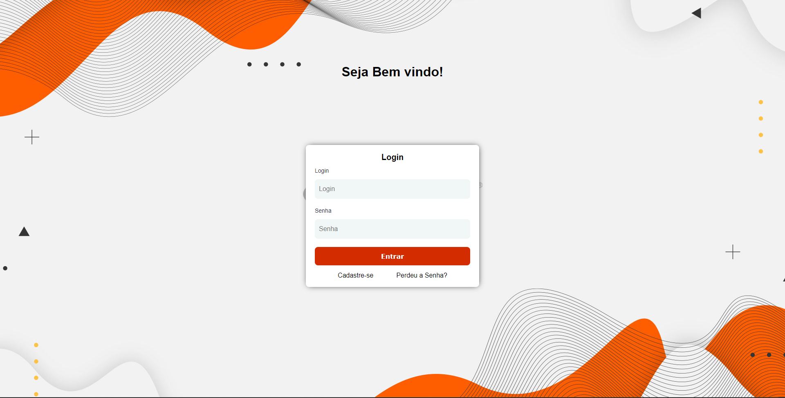
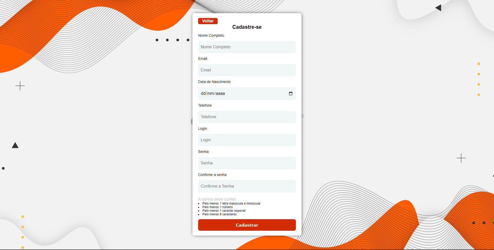
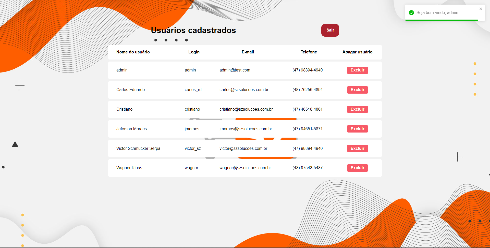

<h1 align="center">Cadastro de Usuários</h1>
<p align="center">Este projeto é um sistema de gerenciamento de usuários, com cadastro, autenticação, validação de senhas e listagem de usuários. Apenas usuários logados podem visualizar suas próprias informações e somente administradores podem visualizar informações de todos os usuários. Além disso, usuários podem alterar suas senhas na tela de login caso esqueçam.</p>
</br>

<p align="center">
  
</p>


## Tecnologias e técnicas utilizadas:

- [ExpressJS](https://expressjs.com/)
- [React](https://pt-br.reactjs.org/),
- [React Router DOM](https://reactrouter.com/docs/en/v6/getting-started/overview),
- [Redux](https://redux.js.org/),
- [Styled components](https://styled-components.com/),
- [Node.js](https://nodejs.org/pt-br/),
- [MySql](https://www.mysql.com),
- [Sequelize](https://sequelize.org/),
- [Nodemon](https://www.npmjs.com/package/nodemon),
- [Json Web Token](https://jwt.io/),
- [BCRYPT](https://www.npmjs.com/package/bcrypt),
- [CORS](https://www.npmjs.com/package/cors),
- [YUP](https://www.npmjs.com/package/yup),
- [React-Toastify](https://npm.io/package/react-toastify)

</br>

### Features

- [x] Cadastro de usuários
- [x] Autenticação de usuários
- [x] Criptografia de senha
- [x] Validação de dados de cadastro
- [x] Gerenciamento de usuários
- [x] Listagem de usuários
- [x] Exclusão de usuários (__ADMIN__)
- [x] Alteração de senhas

</br></br>
<h2 align="center">Building</h2>

## Pré-requisitos

Antes de começar, você precisará das seguintes ferramentas:
</br>


- 
- 

## Iniciando o Projeto


```bash
# Clone este repositório
$ git clone <https://github.com/victorserpa/Registration.git>

# Acesse a pasta do backend
$ cd backend

# Instale as dependências
$ npm install

# Inicie a aplicação
$ npm run app

### Iniciando o Front End

# Retorne para a pasta front-end
$ cd -

# Acesse a pasta do frontend
$ cd frontend

# Instale as dependências
$ npm install

# Inicie a aplicação
$ npm run dev
```

## Configurando o Banco de Dados

- Instale o MySQL (versão 8 ou mais recente) como SERVER ONLY, selecionando o tipo de configuração como "Development Machine". Mantenha a porta padrão 3306 e forneça a senha "1234". Finalize a instalação.

- Se você estiver usando o Windows, vá até o diretório C > Arquivos de Programas > MySQL > BIN e copie a URL da pasta. Em seguida, clique com o botão direito do mouse no Meu Computador, vá em Propriedades, Configurações Avançadas do Sistema e adicione a URL copiada às variáveis de ambiente PATH.

- Abra o Prompt de Comando ou outro programa similar e digite `mysql -h localhost -u root -p`, pressionando enter. Será solicitada a senha "1234". Após inserir a senha, você estará dentro do MySQL.

__Recomendamos executar o comando `create database cadastrodeusuarios` para criar a tabela de cadastro de usuários e evitar alterações no back-end.__

```
- # Acesse a pasta do backend
$ cd backend

# Execute as migrations
$ npx sequelize-cli db:migrate

// Para criar a tabela "users" dentro do banco "cadastrodeusuarios". E em seguida.

# Execute o seed
$ npx sequelize db:seed:all

// Para já adicionar o usuário ADMIN na tabela.
```


<p align="center">
  
</p>

- Agora você já pode realizar o cadastro de usuários e fazer as operações de gerenciamento de usuários através da aplicação.

<p align="center">
  
</p>

## Considerações finais

- Certifique-se de que o serviço do MySQL esteja iniciado antes de iniciar a aplicação.
- Caso necessite, altere as configurações de segurança do MySQL para permitir a conexão local.
- Não esqueça de configurar as variaveis de ambiente necessárias.
- Lembre-se que o usuário pode se cadastrar, porém ao fazer login, somente poderá visualizar as informações dele mesmo. Para visualizar todos os usuários cadastrados, é necessário ser admin.
- É possível para o usuário alterar sua senha através da tela de login


---

Feito com ♥ by Victor Schmücker :wave:
